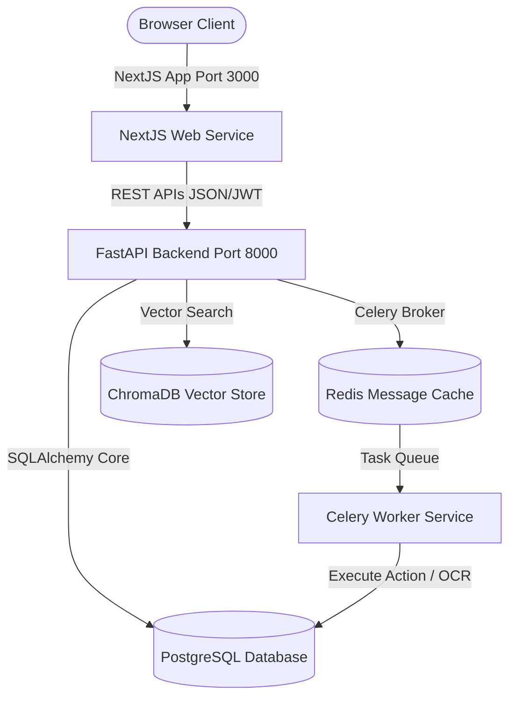
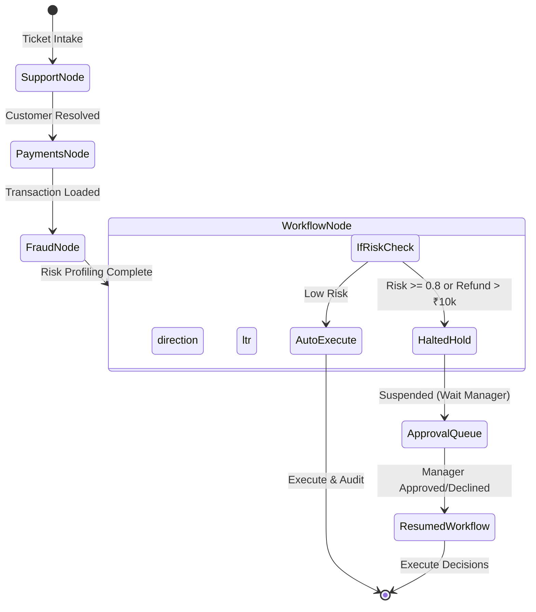

# AI Financial Operations Agent - Architecture Document

This document defines the technical architecture of the AI Financial Operations (FinOps) Agent platform.

---

## 1. System Topology Overview

The system is constructed as a modern, decoupled monorepo containing a Next.js React frontend and a FastAPI backend orchestrating database interactions, LangGraph workflows, and celery background task workers.

---

## 2. Multi-Agent Reasoning Engine (LangGraph)

AI reasoning processes support tickets statefully using specialized agent nodes. If an action is deemed risky (e.g. refunding over ₹10,000, freezing accounts, etc.), the graph suspends itself, saving an interrupt request into the PostgreSQL DB. The graph can be resumed upon manager authorization.

---

## 3. Component Details

1. **Customer Support Agent Node**: Classifies user queries, calculates sentiments, parses entities (like amounts and transaction IDs), and extracts CRM profiles.
2. **Payments Agent Node**: Verifies transaction status, matches ledger gateway entries, checks refund policies, and evaluates limit rules.
3. **Fraud Agent Node**: Assesses risk levels, evaluates chargeback profiles, queries IP device topology networks, and provides risk scores.
4. **Workflow Agent Node**: Compiles the execution schedule and handles routing pathways.
5. **Approval Node (Human-in-the-Loop)**: Intercepts workflow commands and creates manager authorizations.
6. **Celery Worker**: Runs OCR on files, parses incoming emails, and generates investigation PDF report summaries.
7. **ChromaDB**: Holds corporation policies (Refund manual, Fraud triggers, KYC limits) to run RAG.
