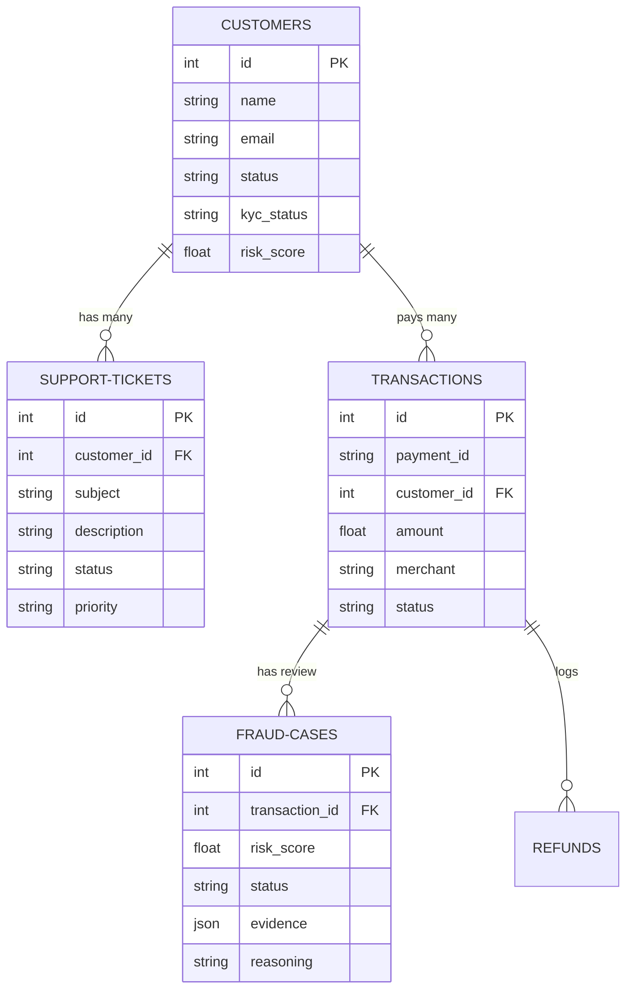

# Database Schema & ER Diagram

This document lists the schema structure and relationships of our database.

---

## 1. Table Definitions

### `users`
Operational system operators (Analyst, Manager, Admin).
* `id` (INTEGER, PK, Auto-increment)
* `email` (VARCHAR, Unique, Indexed)
* `hashed_password` (VARCHAR, Nullable=False)
* `full_name` (VARCHAR, Nullable=False)
* `role` (VARCHAR, Default="Analyst")
* `created_at` (DATETIME, Default=utcnow)
* `is_active` (BOOLEAN, Default=True)

### `customers`
Customer files in CRM.
* `id` (INTEGER, PK, Auto-increment)
* `name` (VARCHAR, Nullable=False)
* `email` (VARCHAR, Unique, Nullable=False)
* `status` (VARCHAR, Default="Active") - Active, Blocked, Frozen
* `kyc_status` (VARCHAR, Default="Pending") - Pending, Approved, Rejected
* `risk_score` (FLOAT, Default=0.0)
* `created_at` (DATETIME)

### `transactions`
Payment gateway capture ledger.
* `id` (INTEGER, PK, Auto-increment)
* `payment_id` (VARCHAR, Unique, Indexed)
* `customer_id` (INTEGER, FK -> customers.id)
* `amount` (FLOAT, Nullable=False)
* `currency` (VARCHAR, Default="INR")
* `merchant` (VARCHAR, Nullable=False)
* `status` (VARCHAR, Default="Success") - Success, Pending, Failed, Refunded
* `description` (VARCHAR, Nullable=True)
* `created_at` (DATETIME)

### `support_tickets`
Customer customer support tickets.
* `id` (INTEGER, PK, Auto-increment)
* `customer_id` (INTEGER, FK -> customers.id)
* `subject` (VARCHAR, Nullable=False)
* `description` (TEXT, Nullable=False)
* `status` (VARCHAR, Default="Open") - Open, Closed
* `priority` (VARCHAR, Default="Medium") - Low, Medium, High, Urgent
* `sentiment` (VARCHAR)
* `created_at` (DATETIME)

### `fraud_cases`
AI flagged suspicious transactions.
* `id` (INTEGER, PK, Auto-increment)
* `transaction_id` (INTEGER, FK -> transactions.id)
* `risk_score` (FLOAT, Default=0.0)
* `status` (VARCHAR, Default="Pending") - Pending, Reviewing, Resolved
* `evidence` (JSON)
* `reasoning` (TEXT)
* `created_at` (DATETIME)

### `approval_requests`
Manager authorization holds for risky actions.
* `id` (INTEGER, PK, Auto-increment)
* `action_type` (VARCHAR) - Refund, AccountBlock, AccountFreeze, FraudHold, KYCRejection
* `target_id` (VARCHAR)
* `details` (JSON)
* `status` (VARCHAR, Default="Pending") - Pending, Approved, Rejected
* `requested_by` (VARCHAR, Default="AI Agent")
* `approved_by` (VARCHAR, Nullable=True)
* `reason` (TEXT, Nullable=True)
* `created_at` (DATETIME)

---

## 2. Relationships ER Diagram

